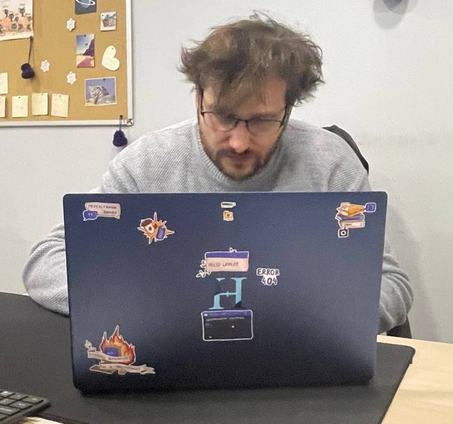

### Aliaksandr Krykun



------

#### Contacts

- **Location:** Minsk, Belarus
- **Phone:** +375 29 126-00-60
- **Email:** kreekun@tut.by
- **Discord**: kreekun

------

#### About Me

I like digital graphics. I especially love working with colors and shades. I want to become a UX designer. But first I want to learn HTML,CSS and JS.

------

#### Skills

- Markdown
- Git

------

#### Code Example

**Instructions:** Implement a function which convert the given boolean value into its string representation.

````javascript
function booleanToString(b){
  if (typeof b !== 'boolean') {
    throw new Error('The parameter must be of type boolean');
  }
  
  return b ? 'true' : 'false';
}
````

------

#### Experience

**Project:** https://nukeerk/github.io/rsschool-cv/cv

------

#### Education

**University:** Belarusian State Aviation Academy, Operation of computer equipment

------

#### English

**A1**(I have no spoken English practice)
